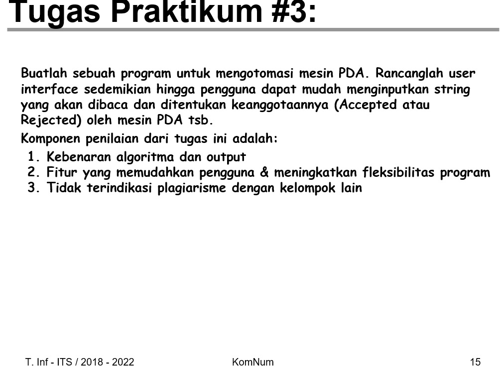

# Tugas Praktikum 2 Kelompok 12

Hasil Jawaban Tugas Praktikum Mata Kuliah Otomata oleh Kelompok 12

### Anggota Kelompok 12

|                       Nama                               		                	|    NRP     |
| :---------------------------------------------------------------------------: | :--------: |
|   [Jahhaza Assiqooyah Nurul Hidayah](https://github.com/jahhaza)             	| 5025241019 |
|   [Mahirah Yasmin Aulia Mawahib](https://github.com/mahirahyam) 			        | 5025241095 |

### Soal Praktikum

### Kode Program
[SourceCode](#praktikumotomata2.py)

### Analisis Program

``import ipywidgets as widgets
from IPython.display import display, clear_output``
``class PDA:
    def __init__(self, transitions, initial_state, initial_stack, final_states):
        self.transitions = transitions
        self.initial_state = initial_state
        self.initial_stack = initial_stack
        self.final_states = final_states ``
        
`import ipywidgets & IPython.display` : Digunakan untuk membangun komponen antarmuka (GUI) interaktif seperti tombol, tab, teks input, dan mengontrol pembersihan output di Jupyter Notebook.
`class PDA` : Inisialisasi struktur data mesin PDA. Mesin ini membutuhkan komponen formal seperti daftar transisi, state awal, simbol awal stack, dan himpunan state akhir (final states).

 `` def is_accepted(self, input_string):
        configs = [(self.initial_state, input_string, self.initial_stack)]
        while configs:
            curr_state, rem_input, stack = configs.pop()
            if not rem_input and curr_state in self.final_states:
                return True ``

`configs = [...]` : Representasi konfigurasi instan mesin PDA yang berisi (`state_saat_ini`, `sisa_input, isi_stack`). Diproses menggunakan pendekatan stack (LIFO/BFS) untuk mendukung sifat Non-deterministic PDA (NPDA).
`if not rem_input and curr_state in self.final_states` : Kondisi penerimaan string. Jika string input sudah habis terbaca (not rem_input) DAN posisi state berada di dalam final states, maka string dinyatakan ACCEPTED (Valid).

  ``char = rem_input[0] if rem_input else None
      stack_top = stack[-1] if stack else None
      if char is not None:
      key = (curr_state, char, stack_top)
      if key in self.transitions:
          for next_state, push_chars in self.transitions[key]:
            new_stack = list(stack[:-1]) + (list(push_chars[::-1]) if push_chars != 'ε' else [])
            configs.append((next_state, rem_input[1:], new_stack))``

`char & stack_top`: Mengintip karakter pertama dari sisa input dan simbol teratas dari stack untuk menentukan langkah transisi berikutnya.
`key` = (curr_state, char, stack_top): Mencari kecocokan aturan transisi berdasarkan kondisi saat ini.
`new_stack` = ...: Melakukan operasi POP (menghapus top stack melalui `stack[:-1`]) dan dilanjutkan dengan operasi PUSH (`push_chars[::-1]`). Karakter dibalik agar urutan masuk ke stack sesuai secara teoritis (karakter pertama berada di paling atas). Jika transisinya adalah ε (epsilon), maka tidak ada karakter baru yang dimasukkan ke stack.

   ``key_eps = (curr_state, 'ε', stack_top)
        if key_eps in self.transitions:
            for next_state, push_chars in self.transitions[key_eps]:
                new_stack = list(stack[:-1]) + (list(push_chars[::-1]) if push_chars != 'ε' else [])
                configs.append((next_state, rem_input, new_stack))``
     `return False`
     
``key_eps = (curr_state, 'ε', stack_top)`` : Menangani Transisi Epsilon (ϵ). Fitur krusial yang membuat PDA dapat berpindah state atau memanipulasi stack tanpa harus mengonsumsi atau memotong karakter dari string input (`rem_input` tetap utuh).
`return False` : Jika seluruh kemungkinan konfigurasi transisi sudah dicoba dan tidak ada yang mencapai final state saat input habis, maka string dinyatakan REJECTED.

``header_html = "
<h2>PDA Automation Dashboard</h2>
"
trans_input = widgets.Textarea(value='q0,a,Z -> q0,AZ\nq0,b,A -> q1,ε\nq1,b,A -> q1,ε\nq1,ε,Z -> q2,Z', layout={'height': '200px', 'width': 'auto'})
init_state = widgets.Text(value='q0', description='Start State:')
final_states = widgets.Text(value='q2', description='Final States:')
init_stack = widgets.Text(value='Z', description='Start Stack:')
string_input = widgets.Text(placeholder='Ketik string di sini...', layout={'width': '70%'})
btn_run = widgets.Button(description='SIMULASI', button_style='success', icon='play', layout={'width': '28%'})
output_box = widgets.Output()
history_output = widgets.Output()``

Definisi Komponen UI: Baris-baris ini membuat elemen visual untuk mempermudah pengguna. Textarea digunakan untuk mengetik transisi yang fleksibel, Text untuk konfigurasi state, Button untuk memicu simulasi, dan Output sebagai wadah penampilan hasil.

``config_box = widgets.VBox([
    widgets.HTML("<b>Pengaturan Dasar:</b>"),
    widgets.HBox([init_state, final_states, init_stack]),
    widgets.HTML("<b>Definisi Transisi (state, char, pop -> next_state, push):</b>"),
    trans_input``
])

``simulator_box = widgets.VBox([
    widgets.HTML("<b>Masukkan String untuk Diuji:</b>"),
    widgets.HBox([string_input, btn_run]),
    output_box,
    widgets.HTML("
<b>Riwayat Uji:</b>"),
    history_output
])``

``tabs = widgets.Tab(children=[config_box, simulator_box])
tabs.set_title(0, 'Konfigurasi Mesin')
tabs.set_title(1, 'Simulator String')``

`widgets.Tab`: Menyusun tata letak (layout) menjadi dua halaman tab terpisah. Tab pertama khusus untuk memodifikasi struktur mesin PDA, dan tab kedua fokus pada pengujian string. Pemisahan ini membuat antarmuka bersih dan meningkatkan pengalaman pengguna (user experience).

``def run_simulation(_):
    with output_box:
        clear_output()
        try:
            rules = {}
            for line in trans_input.value.strip().split('\n'):
                if '->' not in line: continue
                lhs, rhs = line.split('->')
                curr_s, inp, pop = [x.strip() for x in lhs.split(',')]
                next_s, push = [x.strip() for x in rhs.split(',')]
                key = (curr_s, inp, pop)
                if key not in rules: rules[key] = []
                rules[key].append((next_s, push))``

`run_simulation(_)`: Fungsi callback yang berjalan otomatis saat tombol SIMULASI diklik.

Parser Aturan Transisi: Membaca teks mentah dari kode pengguna baris demi baris, memotongnya berdasarkan simbol ->, memisahkan komponen menggunakan koma, lalu menyimpannya ke dalam dictionary rules agar bisa dibaca oleh mesin PDA.

   ``pda = PDA(rules, init_state.value.strip(), [init_stack.value.strip()], [s.strip() for s in final_states.value.split(',')])
     accepted = pda.is_accepted(string_input.value.strip())
     res_color = "#c8e6c9" if accepted else "#ffcdd2"
     text_color = "#2e7d32" if accepted else "#c62828"
     label = "ACCEPTED" if accepted else "REJECTED"``
            
Kebenaran Algoritma & Output (Skor Tinggi): Algoritma berbasis kecocokan konfigurasi instan (NPDA) yang Anda gunakan sudah mampu menangani penjelajahan cabang transisi bercabang secara tepat, lengkap dengan penanganan kondisi Epsilon (ϵ) yang akurat.
